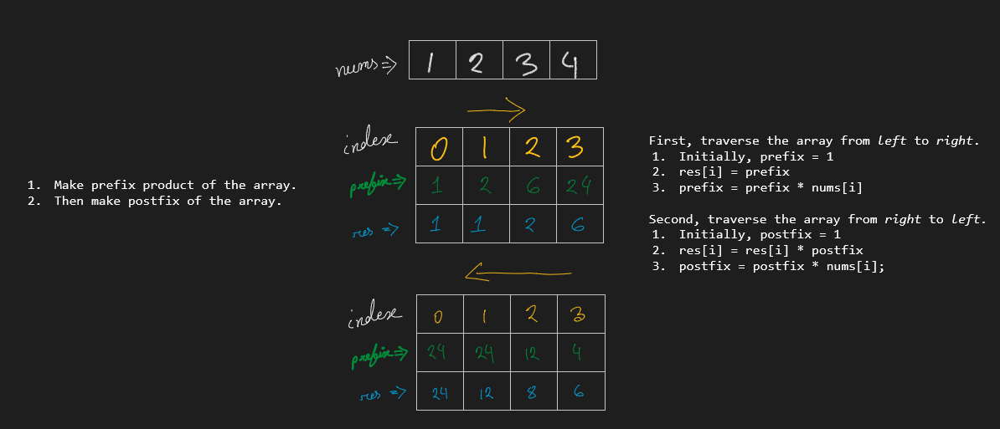

### 238. [Product of Array Except Self](https://leetcode.com/problems/product-of-array-except-self/) `Medium`

---

#### Explanation



#### Complexity

Time: `O(N)`

Space: `O(1)`

#### Code

```cpp
vector<int> productExceptSelf(vector<int>& nums) {
    int size = nums.size(), prefix = 1, postfix = 1;
    vector<int> result(size, 1);

    for (int i = 0; i < size; i++) {
        result[i] = prefix;
        prefix *= nums[i];
    }

    for (int i = size - 1; i >= 0; i--) {
        result[i] *= postfix;
        postfix *= nums[i];
    }

    return result;
}
```
