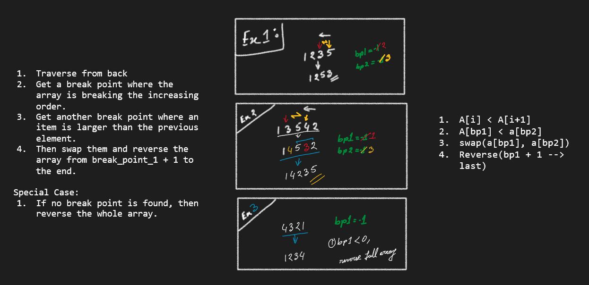

### 15. [Next Permutation](https://leetcode.com/problems/next-permutation/) `Medium`

---

#### Explanation



#### Complexity

Time: `O(N)`

Space: `O(1)`

#### Solution

```cpp
void nextPermutation(vector<int>& nums) {
    int n = nums.size(), break1 = -1, break2 = -1;

    for(int i = n - 2; i >= 0; i--) {
        if (nums[i] < nums[i+1]) {
            break1 = i;
            break;
        }
    }

    if(break1 < 0) {
        reverse(nums.begin(), nums.end());
        return;
    }

    for(int i = n - 1; i > break1; i--) {
        if(nums[i] > nums[break1]) { break2 = i;  break; }
    }

    swap(nums[break1], nums[break2]);
    reverse(nums.begin() + break1 + 1, nums.end());

    return;
}
```
